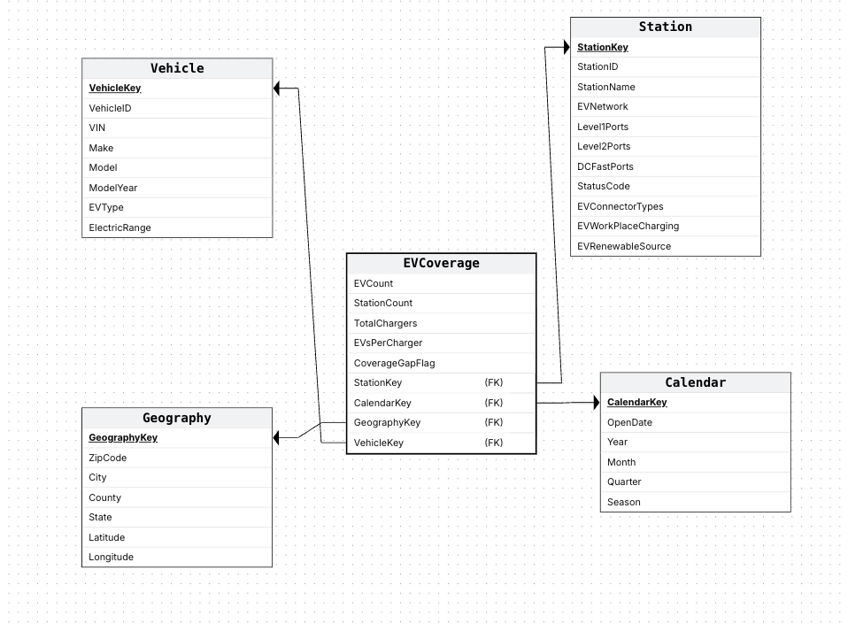
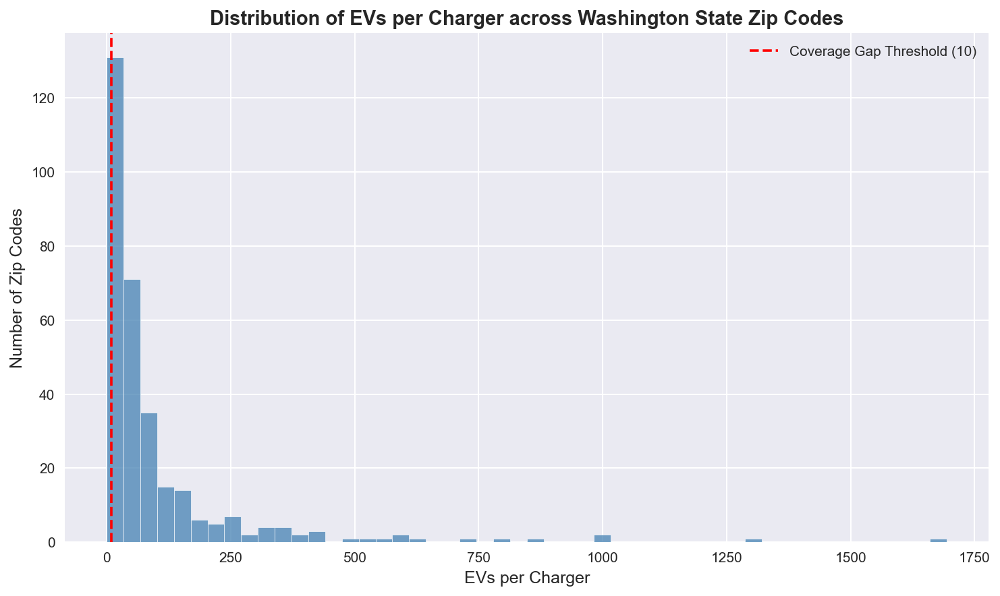
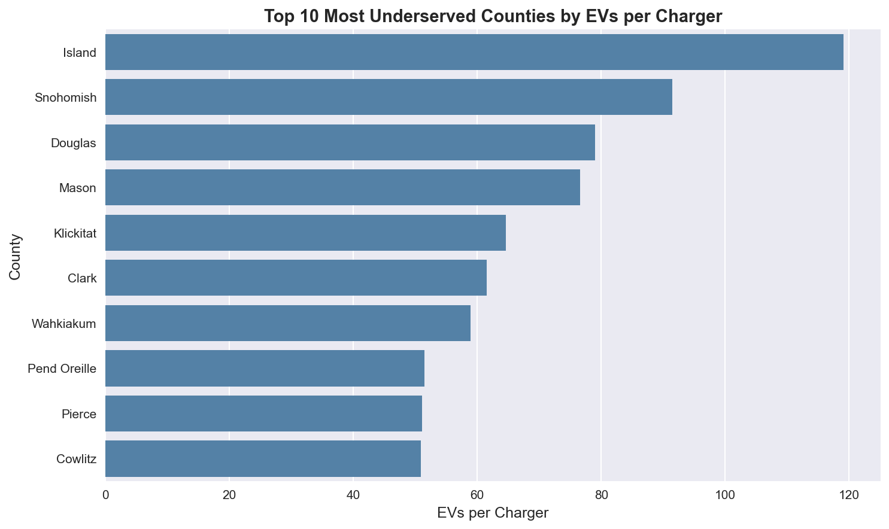
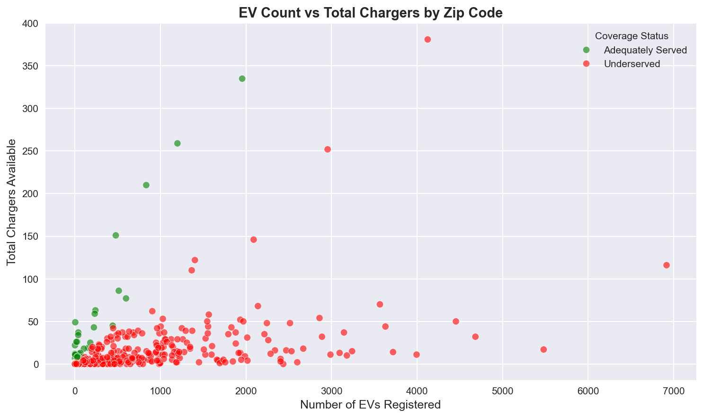
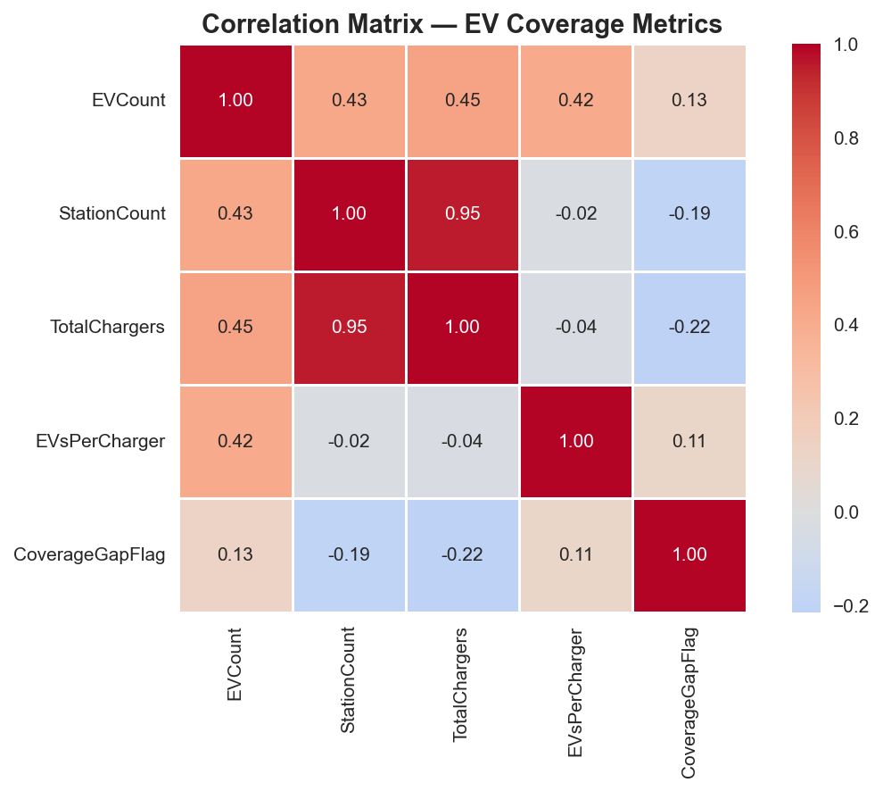
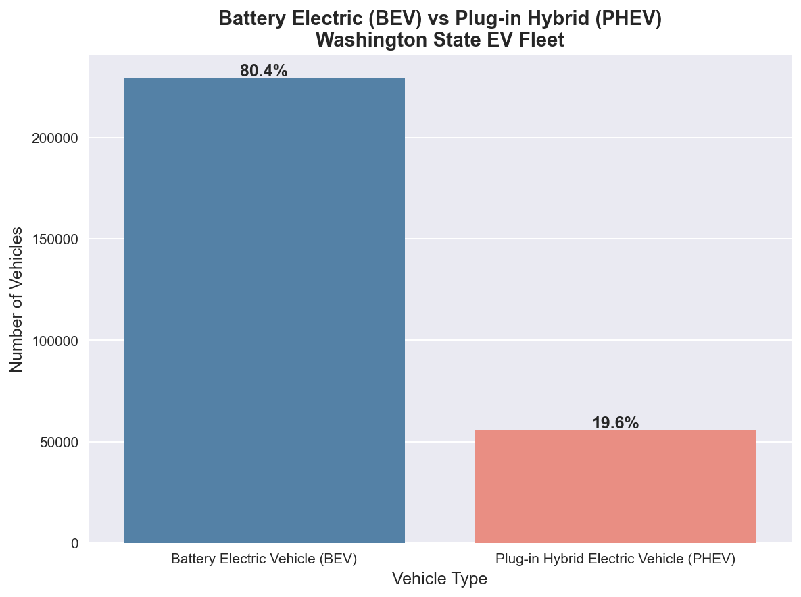

# Washington-State-EV-Charging-Infrastructure-Analysis

## Overview
This project explores the development of electric vehicles across the state of Washington, analyzing the gap between EV adoption and charging infrastructure using real government data. By combining EV registration records from the Washington State Department of Licensing with charging station data from the U.S. Department of Energy, this project identifies underserved communities and models coverage gaps. It delivers findings through 16 SQL analytical queries, a Python EDA and machine learning pipeline, and four interactive Tableau dashboards.

---

## Business Problem
Washington State ranks third in the nation in EV market share at 21.3% of new vehicle sales (Alliance for Automotive Innovation, Q4 2024), with 285,090 registered electric vehicles as of May 2026. However, the charging infrastructure has not kept pace with this rapid adoption.

This project answers the following business questions:

**Coverage & Infrastructure Gap**
- Which zip codes and counties have the most critical EV charging infrastructure gaps?
- Which areas have zero charging infrastructure despite significant EV adoption?
- Which zip codes are adequately served, and what do they have in common?
- How does the coverage gap vary between urban and rural counties?

**Charging Networks & Technology**
- Which charging networks dominate the market in Washington State?
- Which networks lead in DC fast charging vs slow Level 2 charging?
- Which connector types dominate, and are they compatible with current EVs?
- Are there counties critically underserved specifically for DC fast charging?

**EV Adoption & Vehicle Analysis**
- Which counties lead in EV adoption, and what is the average EV density per zip code?
- What is the split between fully electric (BEV) and plug-in hybrid (PHEV) vehicles?
- Which EV makes dominate Washington State?

**Sustainability & Growth**
- Is EV charging infrastructure keeping pace with the growth of EV adoption over time?
- How green is Washington State's charging infrastructure?
- Which counties have the highest concentration of renewable energy charging stations?

**Predictive Analytics**
- Can we predict which zip codes are at risk of becoming underserved as EV adoption grows?
  
---

## Key Findings

**Coverage Gap**
- EV charging infrastructure follows a **heavily right-skewed distribution** — a small number of zip codes are extremely well served, while the vast majority are critically underserved
- **91% of Washington State zip codes** (527 out of 581) are classified as underserved based on a threshold of more than 10 EVs per charger
- **Zip codes 98177 (Seattle), 98053 (Carnation), and 98146 (Burien)**, all in King County, are the most underserved with **up to 1,694 EVs per charger**
- **Kent (98038)** has **2,436 registered EVs and zero charging stations** — the largest completely unserved community in Washington, followed by Carnation (986 EVs) and Lacey (795 EVs)

**Best Served**
- **Zip codes 98164, 98124, and 98195 (Seattle)** are the best served with ratios as low as **0.05 EVs per charger** — commercial districts are oversupplied while surrounding residential areas are critically underserved
- **Lincoln County** is among the best served counties for DC fast charging, with only **9.25 EVs per DC fast charger**

**County Level**
- **King and Snohomish counties** have the highest EV density with **over 1,200 EVs per zip code on average**
- **King County** has 139,296 EVs but only **15 DC fast chargers** — **nearly 9,000 EVs per fast charger** despite being the largest EV market
- **Island County** has the worst ratio among counties with infrastructure at **119 EVs per charger**, followed by **Snohomish at 91.5**
- **Garfield and Ferry counties** have zero EV charging infrastructure despite having registered EVs

**Vehicle Analysis**
- **Battery Electric Vehicles (BEV) represent 80%** of the total EV fleet, with **Tesla as the most popular make at 41% of all registered EVs**

**Networks & Connectors**
- **ChargePoint dominates** the network market with **46.5% of all stations**, but **Tesla leads DC fast charging**
- **J1772 is the most used connector type**, representing nearly **80% of all connectors** in Washington State

**Sustainability**
- Only **0.31% of charging stations** run on renewable energy sources
- **Douglas, Jefferson, Whatcom, and Okanogan** are the only counties with green charging stations — each with only one renewable station

---

## Interactive Dashboards

**Dashboard 1 — The Problem: Where Are the Gaps?**
Analyzes EV charging coverage at zip code and county level across Washington State.
🔗 [View Dashboard 1](https://public.tableau.com/views/Washington_State_EV_Coverage_Analysis_Dashboard1/Dashboard1TheProblemWhereAretheGaps)

**Dashboard 2 — The Scale: How Big is EV Adoption?**
Examines EV adoption growth, electric vehicle types, and top makes across Washington State.
🔗 [View Dashboard 2](https://public.tableau.com/views/Washington_State_EV_Coverage_Analysis_Dashboard2/Dashboard2TheScaleHowBigistheEVAdoption)

**Dashboard 3 — The Infrastructure: Who Provides Charging?**
Explores charging network market share, connector types, and DC fast charging availability.
🔗 [View Dashboard 3](https://public.tableau.com/views/Washington_State_EV_Coverage_Analysis_Dashboard3/Dashboard3TheInfrastructureWhoProvidesCharging)

**Dashboard 4 — Sustainability & Bright Spots**
Highlights green charging infrastructure, renewable energy stations, and best served communities.
🔗 [View Dashboard 4](https://public.tableau.com/views/Washington_State_EV_Coverage_Analysis_Dashboard4/Dashboard4SustainabilityandBrightSpots)

---

## Data Sources
| Dataset | Source | Records |
|---------|--------|---------|
| Electric Vehicle Population Data | Washington State DOL via data.wa.gov | 285,823 EV registrations |
| Alternative Fuel Stations | U.S. Dept of Energy NREL via afdc.energy.gov | 84,735 stations (2,555 WA electric) |

> EV Population Data exclusively tracks BEV and PHEV registrations. 
> Alternative Fuel Stations data filtered to electric fuel type only.
> 285,090 records were retained after matching to valid Washington State zip codes 
> in the data warehouse. The difference of 733 records reflects zip codes that 
> could not be matched during the ETL process.
---

## Tools & Technologies
| Tool | Purpose |
|------|---------|
| PostgreSQL 18 / pgAdmin | Star schema data warehouse design, ETL pipeline (extract from CSV, transform with SQL cleaning and type casting, load into dimensions and fact table), and 16 analytical queries |
| Python 3.14 | EDA, machine learning pipeline, and data export |
| Pandas | Data manipulation and merging warehouse tables |
| scikit-learn | Classification models (Decision Tree, Random Forest, AdaBoost) |
| Matplotlib / Seaborn | EDA chart generation |
| SQLAlchemy | PostgreSQL connection from Python |
| joblib | Machine learning model persistence |
| Jupyter Notebook | Interactive Python development environment |
| Tableau Public | Four interactive dashboards and geospatial visualization |
| VS Code | SQL and Python file editing |

---

## Data Architecture
This project implements a full **data warehouse pipeline** following star schema design:

```
Raw CSV Files
     ↓
Staging Tables (stg_ev_population, stg_ev_stations)
     ↓
Dimension Tables (Vehicle, Station, Geography, Calendar)
     ↓
Fact Table (EVCoverage)
     ↓
Analytical SQL Queries (16 business queries)
     ↓
Python EDA & ML Pipeline
     ↓
Tableau Dashboards (4)
```

**Star Schema:**
- **Fact table:** EVCoverage — zip code level metrics (EVCount, TotalChargers, EVsPerCharger, CoverageGapFlag)
- **Dimensions:** Vehicle, Station, Geography, Calendar
- **Surrogate keys** used throughout following data warehouse best practices
- **Coverage Gap Flag** defined as 1 when EVsPerCharger > 10 or TotalChargers = 0

**Star Schema Diagram:**


---

## Repository Structure
Washington-State-EV-Charging-Infrastructure-Analysis/
├── sql/
│   ├── WashingtonStateEVWarehouseQueries.sql
│   └── WashingtonStateEVAnalyticalQueries.sql
├── query_results/
│   ├── 01_top_underserved_zipcodes.csv
│   ├── 02_best_served_zipcodes.csv
│   ├── 03_zero_charger_zipcodes.csv
│   ├── 04_coverage_gap_by_county.csv
│   ├── 05_ev_adoption_by_county.csv
│   ├── 06_counties_least_fast_charging.csv
│   ├── 07_counties_best_fast_charging.csv
│   ├── 08_ev_type_breakdown.csv
│   ├── 09_top_ev_makes.csv
│   ├── 10_avg_range_by_make.csv
│   ├── 11_network_market_share.csv
│   ├── 12_network_fast_vs_slow.csv
│   ├── 13_connector_types.csv
│   ├── 14_renewable_energy_share.csv
│   ├── 15_green_charging_by_county.csv
│   └── 16_station_openings_by_year.csv
├── notebooks/
│   └── WashingtonStateEVAnalysis.ipynb
├── charts/
│   ├── star_schema.png
│   ├── chart1_evs_per_charger_distribution.png
│   ├── chart2_top10_underserved_counties.png
│   ├── chart3_ev_vs_chargers_scatter.png
│   ├── chart4_correlation_heatmap.png
│   └── chart5_bev_vs_phev.png
├── models/
│   ├── ev_coverage_model.pkl
│   └── ev_coverage_feature_columns.pkl
└── README.md
```

---

## Machine Learning
A **Random Forest classification model** was trained to predict whether a zip code is underserved (CoverageGapFlag = 0 or 1) based on EVCount, StationCount, 
and TotalChargers.

| Model | Accuracy | Precision | Recall |
|-------|----------|-----------|--------|
| Decision Tree | 96.58% | 99.07% | 97.25% |
| Random Forest | 97.44% | 100.00% | 97.25% |
| AdaBoost | 97.44% | 100.00% | 97.25% |

**Best model: Random Forest** — saved as `ev_coverage_model.pkl`

> **Note on Model Limitations:** The high accuracy (97.44%) reflects a fundamental 
> limitation — CoverageGapFlag was mathematically derived from the same three features 
> used for prediction (EVCount, StationCount, TotalChargers). Specifically:
> - CoverageGapFlag = 1 when EVCount / TotalChargers > 10 or TotalChargers = 0
> - The model is essentially learning the rule we explicitly defined in SQL
> - This creates circular reasoning — the target variable is a direct function of the features
>
> **What this means:** The model confirms our business rule rather than discovering 
> new patterns. A truly predictive model would require independent features such as:
> - Population density and demographics per zip code
> - Income levels and home ownership rates
> - Proximity to highways and commercial areas
> - Historical EV adoption growth rates
> - Urban vs rural classification

---

## EDA Charts
| Chart | Description |
|-------|-------------|
|  | Distribution of EVs per Charger — right-skewed pattern showing infrastructure inequality |
|  | Top 10 Underserved Counties — Island County leads at 119 EVs per charger |
|  | EV Count vs Total Chargers — infrastructure not keeping pace with demand |
|  | Correlation Heatmap — StationCount and TotalChargers highly correlated at 0.95 |
|  | BEV vs PHEV Breakdown — 80% of Washington State EVs are fully electric |

---

## How to Run

**Prerequisites:**
- PostgreSQL 18
- Python 3.14
- Jupyter Notebook
- Tableau Public

**Steps:**
1. Clone the repository
2. Copy CSV files to `/tmp/` for PostgreSQL loading:
```bash
cp data/Electric_Vehicle_Population_Data.csv /tmp/ev_population.csv
cp data/alternative_fueling_stations.csv /tmp/alternative_fueling_stations.csv
```
3. Run `sql/WashingtonStateEVWarehouseQueries.sql` in pgAdmin to build the warehouse
4. Run `sql/WashingtonStateEVAnalyticalQueries.sql` for the 16 business queries
5. Open `notebooks/WashingtonStateEVAnalysis.ipynb` in Jupyter and run all cells
6. View the interactive dashboards on Tableau Public via the links above

---

## Data Download
The raw data files are not included in this repository due to size constraints.
Download them directly from the source:

- **EV Population Data:** [data.wa.gov](https://data.wa.gov/Transportation/Electric-Vehicle-Population-Data/f6w7-q2d2)
- **Alternative Fuel Stations:** [afdc.energy.gov](https://afdc.energy.gov/stations#/find/nearest)

## 👤 Author
...
## Author
**David Dupre, MSBA**
Loyola University Chicago — Quinlan School of Business
- [LinkedIn](https://www.linkedin.com/in/david-dupre-4b7955230/?skipRedirect=true)
- [GitHub](https://github.com/DDUPREFRA)
- david.dupre00@gmail.com

---

## Future Work
- Incorporate Washington State total vehicle registration data to calculate EV market penetration by county
- Add demographic and income data to identify equity dimensions of charging gaps
- Expand analysis to other high-EV states (California, Oregon, New York)
- Build a real-time dashboard connected to live DOE charging station API
- Develop a genuinely predictive ML model using independent demographic and geographic features to identify zip codes at risk of becoming underserved before it happens
